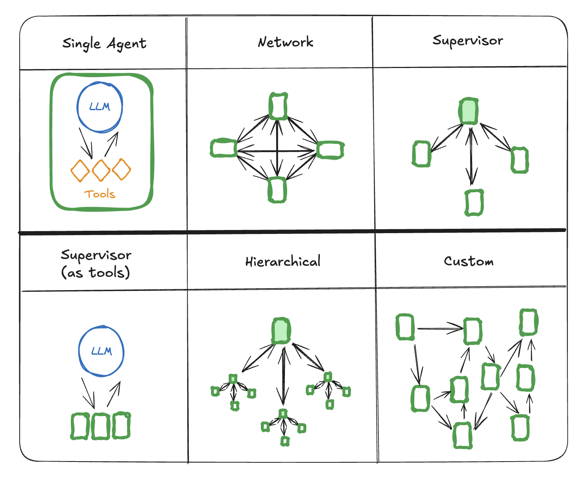

### 多代理架构

- Network

    在此架构中，代理被定义为图节点。每个代理可以与其他代理通信（多对多连接），并可以决定接下来调用哪个代理。
此架构非常适合那些代理层级不明确或代理调用顺序不明确的问题。

- Supervisor

    在此架构中，我们将代理定义为节点，并添加一个主管节点 (LLM)，用于决定下一步应调用哪些代理节点。
我们Command根据主管节点的决定将执行路由到适当的代理节点。此架构也非常适合并行运行多个代理或使用Map-Reduce模式。

- Hierarchical

    随着系统中添加更多代理，主管可能会难以管理所有代理。可以采用分层设计的方式设计系统。
例如，您可以创建独立的、专门的代理团队，每个团队由不同的主管管理，并指定一个顶级主管来管理这些团队。

